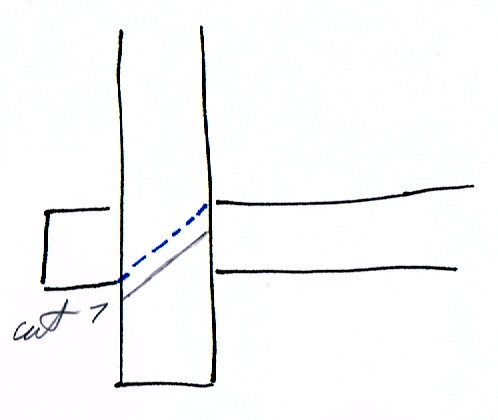
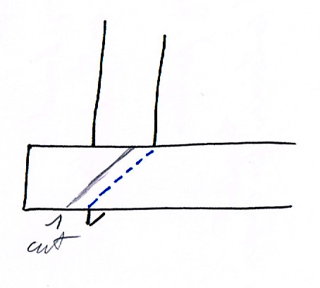
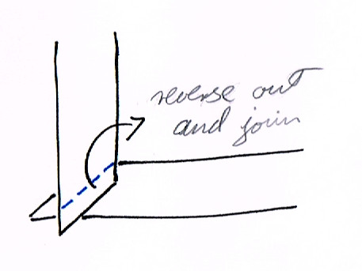
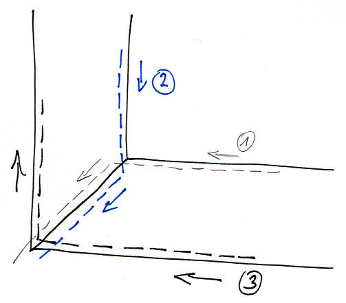

# Borders

## Cutting

If there is space for it on the cloth, use the remaining part at the top for the
long borders, and the side for the short borders. Cutting them this way
preserves the thread alignment.

The thread has to be aligned in the same direction in the borders and the main
cloth, otherwise during washing the border and main cloth will shrink at a
different rate and produce wrinkles.

These are ready to iron and used later.

Fold and iron the edges by gently tapping with the iron. A strong force on the
iron will push the edges out. 0.5 cm is sufficient along the edges.

After ironing, roll up the borders to preserve the ironed edges. Tie up the
rolls with the trim from the edges.

When the borders have to be cut at a different orientation, sections of it
have to be joined up to preserve the thread alignment.

The short borders sometimes have to be cut horizontally from the cloth. Cut the
length to pieces which are the width of the border, and join them one after the
other.

This will preserve the thread orientation when the border is be placed on the
main cloth.

## Sewing

Find the distance at which the joined khandhas can be cut.

Take the line of the kusis and measure which edge is the closest. Draw that
line.

Keep in mind that 1cm will be taken up by he hem for the border.

The drawn area is the available maximum size for the robe. If this is larger
than desired, measure back from the edges evenly and draw the lines for an even
size.

Trim all around.

Examine both sides of the cloth for any defects and choose which side is better.
That will be outside, the borders will be placed there.

Place the cloth on the ironing board with the outside up. Fold up 1cm, iron the
edge by tapping with the iron, and pin it as you go all around the cloth.

Spread the cloth on the floor with the outside up and place the borders along
the edge. Pin it and sew both sides to about 30cm distance from the corners, so
that the ends at the corners are free to manipulate.

After sewing, arrange one corner on the ironing board and iron the edges flat.
Take care that the edges should meet at the exact corner of the main cloth.

Draw the diagonal on both border layers.

Fold out the border, measure 1cm from the diagonal on the flap and trim.

It is difficult to align the flaps using the diagonal mark, since it is covered.
Use the 1cm distance cut edge to align the flaps and pin them before joining.

Join the two flaps.

Cut off the edge corners at a lower than 45 degree angle to not let loose edges
protrude on the sides. Trim any small irregularities which may protrude.

Fold out the flaps and iron flat.

Fold back on the corner, arrange the edges and corners carefully and pin them.

First sew the inner edges, up to the inner corner, then across the diagonal, then
down along the diagonal on the other side and off the corner.

Then sew the outer edge.

Repeat with the other corners and the border is finished.

