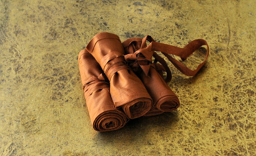

# อนุวาต

## การตัด
ถ้ามีพื้นที่พอบนแผ่นผ้า ใช้ส่วนที่เหลือด้านบนเพื่อทำอนุวาต (ผ้าสาบ)ด้านยาว และใช้ด้านขวางสำหรับด้านสูง หรือตัดผ้าตามแนวหน้าผ้าของแต่ละด้าน

ทางผ้าของอนุวาตต้องเป็นทางเดียวกันกับผ้าผืนหลัก ไม่เช่นนั้นอาจจะเกิดปัญหาผ้าย่นเพราะการหดตัวต่างกันของทางผ้าเมื่อผ่านการซัก

ภาพข้างล่างเป้นตัวอย่างอนุวาตที่รีดและม้วนเก็บพร้อมที่จะใช้งาน

พับและรีดชอบผ้าด้วยการทับเบาๆ ปรมาณ 0.5-1 ซม. จากขอบผ้า ด้วยเตารีดเพื่อให้เกิดรอยง่ายต่อการกดรีดแรงขึ้น

เมื่อรีดขอบทางยาวทังสองข้างแล้วม้วนเก็บโดยให้รอยรีดอยู่ด้านนอก ผูกด้วยเศษผ้าเก็บให้เรียบร้อย

หากความยาวของหน้าผ้าไม่พอกับความยาวอนุวาตทีต้องการ จำเป็นต้องต่อ
