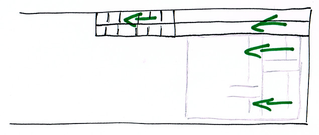
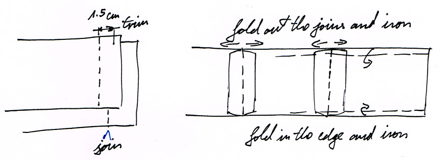
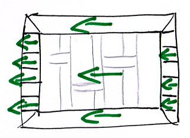
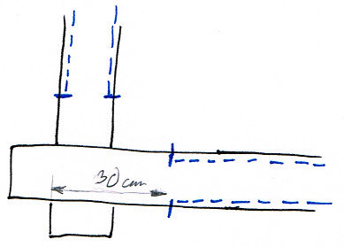
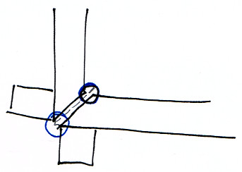
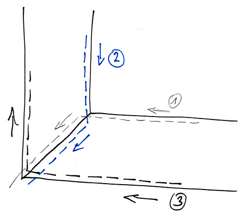

# Borders

- [Cutting](#cutting)
- [Sewing](#sewing)

## Cutting

If there is space for it on the cloth, use the remaining part at the top for the
long borders, and the side for the short borders. Cutting them this way
preserves the thread alignment.

The thread has to be aligned in the same direction in the borders and the main
cloth, otherwise during washing the border and main cloth will shrink at a
different rate and produce wrinkles.

These are ready to iron and used later.

Fold and iron the edges by gently tapping with the iron. A strong force on the
iron will push the edges out. 0.5 cm is sufficient along the edges.

After ironing, roll up the borders to preserve the ironed edges. Tie up the
rolls with the trim from the edges.

[![borders rolled up][borders]][borders-orig]

[borders]: ../img/sanghati/photos/borders-rolled-up_w500.jpg
[borders-orig]: ../img/sanghati/photos/borders-rolled-up_orig.jpg

When the borders have to be cut at a different orientation, sections of it
have to be joined up to preserve the thread alignment.

The short borders sometimes have to be cut horizontally from the cloth. Cut the
length to pieces which are the width of the border, and join them one after the
other.

This will preserve the thread orientation when the border is be placed on the
main cloth.

## Sewing

Find the distance at which the joined khandhas can be cut.

Take the line of the kusis and measure which edge is the closest. Draw that
line.

[![mark trim area long sides][mark-trim-area]][mark-trim-area-orig]

[mark-trim-area]: ../img/borders/photos/mark-trim-area_w500.jpg
[mark-trim-area-orig]: ../img/borders/photos/mark-trim-area_orig.jpg

[![mark trim area short sides][mark-trim-area-side]][mark-trim-area-side-orig]

[mark-trim-area-side]: ../img/borders/photos/mark-trim-area-side_w500.jpg
[mark-trim-area-side-orig]: ../img/borders/photos/mark-trim-area-side_orig.jpg

Keep in mind that 1cm will be taken up by he hem for the border.

The drawn area is the available maximum size for the robe. If this is larger
than desired, measure back from the edges evenly and draw the lines for an even
size.

Trim all around.

Examine both sides of the cloth for any defects and choose which side is better.
That will be outside, the borders will be placed there.

Place the cloth on the ironing board with the outside up. Fold up 1cm, iron the
edge by tapping with the iron, and pin it as you go all around the cloth.

[![iron the edges][iron-edges-and-pin]][iron-edges-and-pin-orig]

[iron-edges-and-pin]: ../img/borders/photos/iron-edges-and-pin_w500.jpg
[iron-edges-and-pin-orig]: ../img/borders/photos/iron-edges-and-pin_orig.jpg

Spread the cloth on the floor with the outside up and place the borders along
the edge. Pin it and sew both sides to about 30cm distance from the corners, so
that the ends at the corners are free to manipulate.

[![pin borders][pin-borders]][pin-borders-orig]

[pin-borders]: ../img/borders/photos/pin-borders_w500.jpg
[pin-borders-orig]: ../img/borders/photos/pin-borders_orig.jpg

After sewing, arrange one corner on the ironing board and iron the edges flat.
Take care that the edges should meet at the exact corner of the main cloth.

[![iron flat][corner-01-arrange-and-iron-flat]][corner-01-arrange-and-iron-flat-orig]

[corner-01-arrange-and-iron-flat]: ../img/borders/photos/corner-01-arrange-and-iron-flat_w500.jpg
[corner-01-arrange-and-iron-flat-orig]: ../img/borders/photos/corner-01-arrange-and-iron-flat_orig.jpg

Draw the diagonal on both border layers.

[![draw diagonal top][corner-02-mark-diagonal-top]][corner-02-mark-diagonal-top-orig]

[corner-02-mark-diagonal-top]: ../img/borders/photos/corner-02-mark-diagonal-top_w500.jpg
[corner-02-mark-diagonal-top-orig]: ../img/borders/photos/corner-02-mark-diagonal-top_orig.jpg

[![draw diagonal bottom][corner-03-mark-diagonal-bottom]][corner-03-mark-diagonal-bottom-orig]

[corner-03-mark-diagonal-bottom]: ../img/borders/photos/corner-03-mark-diagonal-bottom_w500.jpg
[corner-03-mark-diagonal-bottom-orig]: ../img/borders/photos/corner-03-mark-diagonal-bottom_orig.jpg

Fold them in along the diagonal. The flaps should be folded inside.

[![fold flaps inside][corner-04-fold-flaps-inside]][corner-04-fold-flaps-inside-orig]

[corner-04-fold-flaps-inside]: ../img/borders/photos/corner-04-fold-flaps-inside_w500.jpg
[corner-04-fold-flaps-inside-orig]: ../img/borders/photos/corner-04-fold-flaps-inside_orig.jpg

Take care to align the corner of the two borders, the corner of the main cloth
and the end of the diagonal mark.

Fold out on border, measure 1.5cm from the diagonal on the flap and trim.

[![mark flap to trim][corner-05-mark-flap-to-trim]][corner-05-mark-flap-to-trim-orig]

[corner-05-mark-flap-to-trim]: ../img/borders/photos/corner-05-mark-flap-to-trim_w500.jpg
[corner-05-mark-flap-to-trim-orig]: ../img/borders/photos/corner-05-mark-flap-to-trim_orig.jpg

[![trim the flap][corner-06-trim-flap]][corner-06-trim-flap-orig]

[corner-06-trim-flap]: ../img/borders/photos/corner-06-trim-flap_w500.jpg
[corner-06-trim-flap-orig]: ../img/borders/photos/corner-06-trim-flap_orig.jpg

Fold out both borders and arrange one on top of the other and pin it.

[![pin flaps][corner-07-pin-flaps]][corner-07-pin-flaps-orig]

[corner-07-pin-flaps]: ../img/borders/photos/corner-07-pin-flaps_w500.jpg
[corner-07-pin-flaps-orig]: ../img/borders/photos/corner-07-pin-flaps_orig.jpg

Join the two flaps.

[![join flaps][corner-08-joined]][corner-08-joined-orig]

[corner-08-joined]: ../img/borders/photos/corner-08-joined_w500.jpg
[corner-08-joined-orig]: ../img/borders/photos/corner-08-joined_orig.jpg

Trim the other flap as well.

[![trim other flap][corner-09-trim]][corner-09-trim-orig]

[corner-09-trim]: ../img/borders/photos/corner-09-trim_w500.jpg
[corner-09-trim-orig]: ../img/borders/photos/corner-09-trim_orig.jpg

Cut off the edge corners at a lower than 45 degree angle to not let loose edges
protrude on the sides. Trim any small irregularities which may protrude.

Fold out the flaps and iron flat.

[![fold and iron][corner-10-flatten]][corner-10-flatten-orig]

[corner-10-flatten]: ../img/borders/photos/corner-10-flatten_w500.jpg
[corner-10-flatten-orig]: ../img/borders/photos/corner-10-flatten_orig.jpg

Fold back on the corner, arrange the edges and corners carefully and pin them.

[![pin to the cloth][corner-11-pin-to-cloth]][corner-11-pin-to-cloth-orig]

[corner-11-pin-to-cloth]: ../img/borders/photos/corner-11-pin-to-cloth_w500.jpg
[corner-11-pin-to-cloth-orig]: ../img/borders/photos/corner-11-pin-to-cloth_orig.jpg

First sew the inner edges, up to the inner corner, then across the diagonal, then
down along the diagonal on the other side and off the corner.

Then sew the outer edge.

[![corner sewing lines][corner-12-sewing-lines]][corner-12-sewing-lines-orig]

[corner-12-sewing-lines]: ../img/borders/photos/corner-12-sewing-lines_w500.jpg
[corner-12-sewing-lines-orig]: ../img/borders/photos/corner-12-sewing-lines_orig.jpg

[![inner corner][corner-13-sewing-inner-corner]][corner-13-sewing-inner-corner-orig]

[corner-13-sewing-inner-corner]: ../img/borders/photos/corner-13-sewing-inner-corner_w500.jpg
[corner-13-sewing-inner-corner-orig]: ../img/borders/photos/corner-13-sewing-inner-corner_orig.jpg

Repeat with the other corners and the border is finished.

