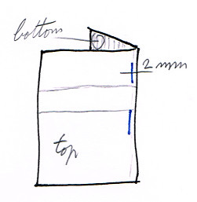

# Sanghati Sewing Guide

- [Drawing and Cutting](#drawing-and-cutting)
- [Cutting the Borders](#cutting-the-borders)
- [First Sewing](#first-sewing)
- [Joining the Layers](#joining-the-layers)
- [Joining the Khandhas](#joining-the-khandhas)
- [Sewing the Borders](#sewing-the-borders)

## Drawing and Cutting

Cut off the length of the cloth and iron it, so that the cloth lies smooth and flat.

Cut off 10cm longer on each side to allow for mistakes.

Fold up a short length, align the edges to be parallel, this will establish a 90
degree corner. Crease the corners of the fold to create a mark.

Fold out and use the creased marks to measure where the edge of the drawing is
going to start.

Mark the bottom edge above the holes of the salvage on the edge. Use this as the
bottom side of the drawing.

Identify the top and bottom side of the cloth. The top side is slightly more
reflective, and the bottom is more matt. When a corner is folded over, the
difference should be possible to tell when looking at the cloth at a low angle.

Draw the marks on the top side. (TOOD: confirm)

Mark the lenghts and draw the pattern.

On the *khanda lines* that you are intending to cut, carry the crossing line
over a few centimeters to keep a mark of the positions after the cut.

After the lines are drawn, cut the edges around, and cut the dividing line of
the khandas.

For the second layer, the already marked cloths can be placed over the blank
cloth and the marks can be copied over easily.

The top and bottom side of the cloth have to be observed. The marks again have
to be drawn on the top side of the second layer, but the first layer have to be
flipped on the vertical axis when marking, to produce a mirror image.

## Cutting the Borders

See [the Border Sewing Guide](borders.html#cutting)

## First Sewing

Start the first sewing from the broken lines (1).

Sew on the marked side. Start from a hand-span away from the kusi, lock the
thread at the start with reverse sewing.

Sew towards the kusi, and stop at 2mm before the kusi line.

Move to the other side of the kusi, and continue the line. Lock the far edges by
reverse sewing. The inner edge doesn't have to be locked, the second sewing will
cross and lock it.

[![first sewing][first-sewing]][first-sewing-orig]

[first-sewing]: ../img/sanghati/photos/first-sewing_w500.jpg
[first-sewing-orig]: ../img/sanghati/photos/first-sewing_orig.jpg

## Joining the Layers

Start with the middle khandha, take both layers and arrange them with the sewing inside.

Take the horizontal kusi line and fold it down on the two sides.

Pin them below the sewn line and fold back to check that the kusi will be on a
lower level than the mandala.

[![join horizontal pinned][join-horizontal-pinned]][join-horizontal-pinned-orig]

[join-horizontal-pinned]: ../img/sanghati/photos/join-horizontal-pinned_w500.jpg
[join-horizontal-pinned-orig]: ../img/borders/photos/join-horizontal-pinned_orig.jpg

[![join horizontal fold out][join-horizontal-fold-out]][join-horizontal-fold-out-orig]

[join-horizontal-fold-out]: ../img/sanghati/photos/join-horizontal-fold-out_w500.jpg
[join-horizontal-fold-out-orig]: ../img/borders/photos/join-horizontal-fold-out_orig.jpg

This is also called the "canal" and the "shore", if you imagine the kusis being
the watering canals between rice paddy fields.

Sew the layer together below the first sewing, within 1-2 mm. Sew both
horizontal kusi lines this way.

[![join sew below line][join-sew-below-line]][join-sew-below-line-orig]

[join-sew-below-line]: ../img/sanghati/photos/join-sew-below-line_w500.jpg
[join-sew-below-line-orig]: ../img/borders/photos/join-sew-below-line_orig.jpg

It is possible to fold the first one in the wrong direction, and when you fold
it back, the kusi ends up higher. When folded in the wrong direction, there will
be a flap at the corner.

When it is folded in the right direction, the flap will be inside.

[![fold before join][fold-before-join]][fold-before-join-orig]

[fold-before-join]: ../img/sanghati/photos/fold-before-join_w500.jpg
[fold-before-join-orig]: ../img/borders/photos/fold-before-join_orig.jpg

[![fold flap inside][fold-flap-inside]][fold-flap-inside-orig]

[fold-flap-inside]: ../img/sanghati/photos/fold-flap-inside_w500.jpg
[fold-flap-inside-orig]: ../img/borders/photos/fold-flap-inside_orig.jpg

Pin the layers, and double-check by folding it back out, that the kusi is lower
than the mandala.

Join the horizontal lines this way.

[![fold joined][fold-joined]][fold-joined-orig]

[fold-joined]: ../img/sanghati/photos/fold-joined_w500.jpg
[fold-joined-orig]: ../img/borders/photos/fold-joined_orig.jpg

Join the vertical lines in the same manner, but stop at 2mm from the horizontal lines.

[![join sew close][join-sew-close]][join-sew-close-orig]

[join-sew-close]: ../img/sanghati/photos/join-sew-close_w500.jpg
[join-sew-close-orig]: ../img/borders/photos/join-sew-close_orig.jpg

## Joining the Khandhas

Join one of the side khandhas to the middle khandha.

Measure the visible kusi width on the middle khandha. If you started with a 6cm
kusi, and did the sewing at 2mm on both lines, the result shuld be about 5.5mm
visible kusi width on the cloth.

When joining the side khandha, allow 1cm from the edge for sewing.

To get a 5.5cm kusi, mark the cloth at 6.5cm and trim the egde.

Pull the sewing line against the edge of a ruler to straighten the cloth.

[![prepare to trim][khandhas-prepare-to-trim]][khandhas-prepare-to-trim-orig]

[khandhas-prepare-to-trim]: ../img/sanghati/photos/khandhas-prepare-to-trim_w500.jpg
[khandhas-prepare-to-trim-orig]: ../img/borders/photos/khandhas-prepare-to-trim_orig.jpg

Trim.

[![trim before join][khandhas-trim-before-join]][khandhas-trim-before-join-orig]

[khandhas-trim-before-join]: ../img/sanghati/photos/khandhas-trim-before-join_w500.jpg
[khandhas-trim-before-join-orig]: ../img/borders/photos/khandhas-trim-before-join_orig.jpg

Place the side layers on top and bottom of the middle layer. Find the pencil
marks of the kusi lines and align them evenly.

[![align kusis with pencil marks][khandhas-align-kusis-pencil-mark]][khandhas-align-kusis-pencil-mark-orig]

[khandhas-align-kusis-pencil-mark]: ../img/sanghati/photos/khandhas-align-kusis-pencil-mark_w500.jpg
[khandhas-align-kusis-pencil-mark-orig]: ../img/borders/photos/khandhas-align-kusis-pencil-mark_orig.jpg

[![align kusis pencil marks closeup][khandhas-align-kusis-pencil-mark-closeup]][khandhas-align-kusis-pencil-mark-closeup-orig]

[khandhas-align-kusis-pencil-mark-closeup]: ../img/sanghati/photos/khandhas-align-kusis-pencil-mark-closeup_w500.jpg
[khandhas-align-kusis-pencil-mark-closeup-orig]: ../img/borders/photos/khandhas-align-kusis-pencil-mark-closeup_orig.jpg

[![align kusis][khandhas-align-kusis]][khandhas-align-kusis-orig]

[khandhas-align-kusis]: ../img/sanghati/photos/khandhas-align-kusis_w500.jpg
[khandhas-align-kusis-orig]: ../img/borders/photos/khandhas-align-kusis_orig.jpg

Pin the four layers and sew them at 1cm from the edge of the cloth. Before
sewing, you can double-check the arrangement by folding the layers out along the
pins. Check that the kusi lower, and kusis are aligned across the cloth.

[![pin edges][khandhas-pin-edges]][khandhas-pin-edges-orig]

[khandhas-pin-edges]: ../img/sanghati/photos/khandhas-pin-edges_w500.jpg
[khandhas-pin-edges-orig]: ../img/borders/photos/khandhas-pin-edges_orig.jpg

[![pin edges closeup][khandhas-pin-edges-closeup]][khandhas-pin-edges-closeup-orig]

[khandhas-pin-edges-closeup]: ../img/sanghati/photos/khandhas-pin-edges-closeup_w500.jpg
[khandhas-pin-edges-closeup-orig]: ../img/borders/photos/khandhas-pin-edges-closeup_orig.jpg

[![fold out][khandhas-fold-out]][khandhas-fold-out-orig]

[khandhas-fold-out]: ../img/sanghati/photos/khandhas-fold-out_w500.jpg
[khandhas-fold-out-orig]: ../img/borders/photos/khandhas-fold-out_orig.jpg

[![before sewing][khandhas-before-sewing]][khandhas-before-sewing-orig]

[khandhas-before-sewing]: ../img/sanghati/photos/khandhas-before-sewing_w500.jpg
[khandhas-before-sewing-orig]: ../img/borders/photos/khandhas-before-sewing_orig.jpg

[![join sewing][khandhas-join-sewing]][khandhas-join-sewing-orig]

[khandhas-join-sewing]: ../img/sanghati/photos/khandhas-join-sewing_w500.jpg
[khandhas-join-sewing-orig]: ../img/borders/photos/khandhas-join-sewing_orig.jpg

After sewing, trim the edge at 3mm from the sewn line.

[![trim after join][khandhas-trim-after-join]][khandhas-trim-after-join-orig]

[khandhas-trim-after-join]: ../img/sanghati/photos/khandhas-trim-after-join_w500.jpg
[khandhas-trim-after-join-orig]: ../img/borders/photos/khandhas-trim-after-join_orig.jpg

The other lines of the side khandhas are joined the same way as before.

Continue with joining the other side to the middle khandha and proceed outward
until all the khandhas are joined.

## Sewing the Borders

See [Borders](borders.html#sewing).

